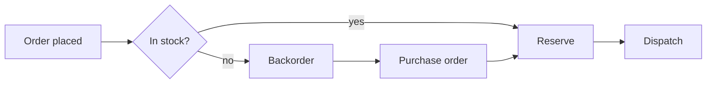
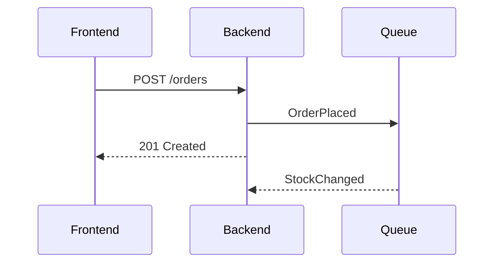
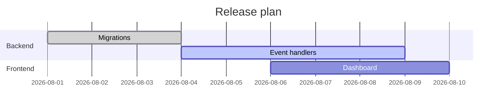

## Text and inline formatting

Standard Markdown works as expected: **bold**, _italic_, `inline code`, ~~strikethrough~~,
and [links](https://example.com). Typographic replacement turns "quotes" into curly ones
and -- into en dashes.

> Blockquotes, like every other element, are styled against the `.doc` wrapper in
> `theme.css` rather than through `@tailwindcss/typography`'s `prose` class.

## Tailwind classes in Markdown

Because Tailwind scans the generated HTML, utility classes work three ways.

### Via markdown-it-attrs {.text-blue-600}

That heading carries `{.text-blue-600}` in the source.

### Via inline HTML

Note the `break-inside-avoid` class — Tailwind's page-break utilities work here, so this
card row is kept whole rather than split across pages.

<div class="not-prose my-6 grid grid-cols-3 gap-3 break-inside-avoid">
  <div class="rounded-lg border border-emerald-200 bg-emerald-50 p-4">
    <p class="text-2xl font-bold text-emerald-700">9,836</p>
    <p class="text-xs uppercase tracking-wide text-emerald-600">Units on hand</p>
  </div>
  <div class="rounded-lg border border-amber-200 bg-amber-50 p-4">
    <p class="text-2xl font-bold text-amber-700">1,618</p>
    <p class="text-xs uppercase tracking-wide text-amber-600">Written off</p>
  </div>
  <div class="rounded-lg border border-slate-200 bg-slate-50 p-4">
    <p class="text-2xl font-bold text-slate-700">2,440</p>
    <p class="text-xs uppercase tracking-wide text-slate-600">Net change</p>
  </div>
</div>

### Via the document wrapper

Classes on the `.doc` wrapper in `wrapDocument()` apply to the whole document; edit
`theme.css` to change the house style for every document at once.

## Syntax highlighting

Handled by `highlight.js` at build time, so there is no browser work and the output is
deterministic.

```ts
export async function renderPdf(html: string, out: string): Promise<void> {
  const browser = await puppeteer.launch({ args: ['--no-sandbox'] });
  const page = await browser.newPage();
  await page.setContent(html, { waitUntil: 'networkidle0' });
  await page.pdf({ path: out, format: 'A4', printBackground: true });
  await browser.close();
}
```

```sql
select sku, sum(quantity) as qty
from inventory_movement
where warehouse = 'north'
group by sku
order by qty desc;
```

## Mathematical notation

TeX is typeset by **KaTeX** at build time, alongside the syntax highlighter — the HTML that
reaches the browser already contains the finished formulas.

Inline math goes between single dollars: the harmonic mean of $P$ and $R$ is
$F = \dfrac{2PR}{P+R}$, and a point $x \in \mathbb{R}^n$ has $\lVert x \rVert_2 = \sqrt{\sum_i x_i^2}$.

Display math goes between double dollars, on their own lines:

$$
d^2(x, u) = (x_1 - u_1)^2 + (x_2 - u_2)^2 + \cdots + (x_n - u_n)^2
$$

A fenced block tagged `math` is the same thing, for editors that prefer a fence:

```math
P(c \mid x) \propto P(c) \prod_{j=1}^{m} P(x_j \mid c)
```

Environments, alignment and boxed results all work:

$$
\begin{aligned}
  \text{acc} &= \frac{TP + TN}{TP + FP + FN + TN} \\[2pt]
  P          &= \frac{TP}{TP + FP} \qquad R = \frac{TP}{TP + FN} \\[2pt]
  F          &= \frac{2PR}{P + R} = \boxed{\tfrac{25}{33}} \approx 0.76
\end{aligned}
$$

$$
A = \begin{bmatrix} 3 & 2 & 1 \\ -1 & 1 & 0 \\ 0 & 1 & -1 \end{bmatrix}
\qquad
\Theta(n \log n) \le \Theta(n^2)
$$

To write a literal dollar sign, escape it: \$4.99 stays text.

## Mermaid diagrams

Each fence is rendered in-page and **awaited** before the PDF is snapshotted — the step
that `md-to-pdf` gets wrong.







## Tables

| Warehouse | Region | Location prefix | Units |
| --------- | ------ | --------------- | ----: |
| north-1   | North  | N1              | 4,102 |
| south-1   | South  | S1              | 6,238 |
| south-2   | South  | S2              | 3,598 |

## Lists

1. Ordered lists survive page breaks.
2. Nested items indent correctly.
   - Unordered child
   - Another child
3. Task lists render as plain checkboxes:
   - [x] Mermaid rendering awaited
   - [x] Math typeset at build time
   - [x] Tailwind compiled per-document
   - [ ] Cached CSS between runs
